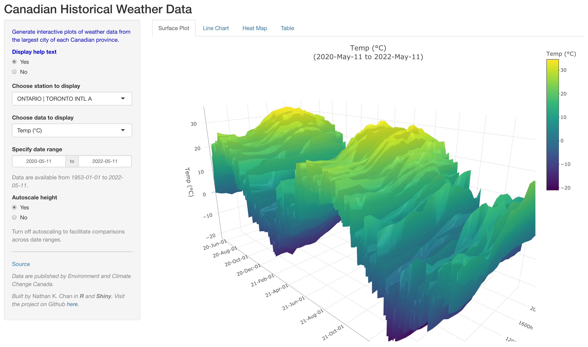

# Canadian Historical Weather Data

***Prepared by Nathan K. Chan***

**To visit the project website, please visit:** [**https://nathankchan.github.io/canadian-weather/**](https://nathankchan.github.io/canadian-weather/)

**To visit this project on Github, please visit:** [**https://github.com/nathankchan/canadian-weather**](https://github.com/nathankchan/canadian-weather)

**To access the online application, please visit:** [**https://nathankchan.shinyapps.io/canadian-weather/**](https://nathankchan.shinyapps.io/canadian-weather/)

## Overview

This project hosts an interactive tool to explore historical Canadian weather data. You can also download and run this project locally.

[**Visit the app**](https://nathankchan.shinyapps.io/canadian-weather/) to generate custom visualizations of weather data from the largest city in each Canadian province. Browse the data through **surface plots**, **line charts**, and **heat maps**!

<center></center>

## Project Description

**This project requires** ***R*** **to be installed.** If it is not installed, please visit [r-project.org](https://www.r-project.org/) to download the latest version. This project also requires the following **R** packages to be installed:

  * [*tidyverse*](https://www.tidyverse.org/)
  * [*plotly*](https://plotly.com/r/)
  * [*htmlwidgets*](https://www.htmlwidgets.org/)
  * [*shiny*](https://shiny.rstudio.com/) (for interactive Shiny app)

To run this project locally, download the repository and set your directory to the project directory. Then, run `run.sh` from terminal. 

Hourly weather data from select Canadian cities will be downloaded to `{project_dir}/data`. This initial download may take *several hours*. To update the project with the most up-to-date data, re-run `run.sh`. Updates may take a several minutes depending on the number of files to update.

```{sh}
cd {project_dir}
source run.sh
```

To load the interactive Shiny app locally, run `app.R` from terminal and visit the link (e.g., `http://127.0.0.1:{port}`). Quit terminal (press `CTRL+C`) to close the app. For example,

```{sh}
cd {project_dir}
Rscript app.R
```
