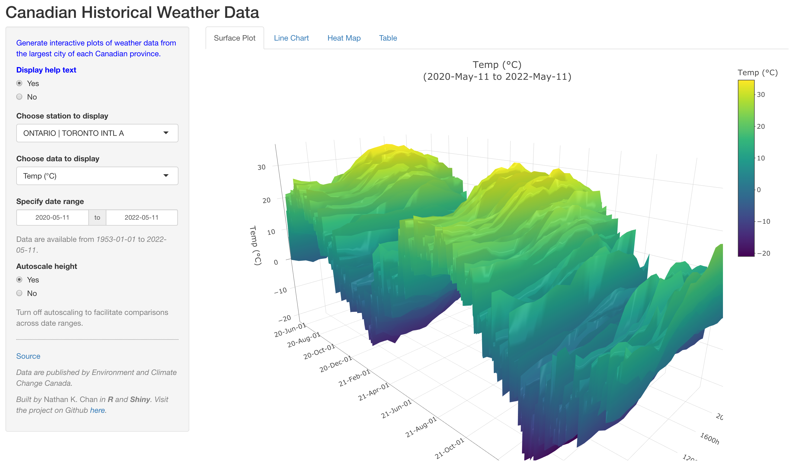

# Canadian Historical Weather Data

***Prepared by Nathan K. Chan***

**Project website:** [https://nathankchan.github.io/canadian-weather/](https://nathankchan.github.io/canadian-weather/)

**GitHub repository:** [https://github.com/nathankchan/canadian-weather](https://github.com/nathankchan/canadian-weather)

**Online application:** [https://nathankchan.shinyapps.io/canadian-weather/](https://nathankchan.shinyapps.io/canadian-weather/)

## Overview

This project is an interactive Shiny web application for exploring historical hourly weather data across all 13 Canadian provinces and territories. Data is sourced from [Environment and Climate Change Canada (ECCC)](https://climate.weather.gc.ca/historical_data/search_historic_data_e.html) and covers **960 active weather stations**.

Browse the data through five views: **Map**, **Surface Plot**, **Line Chart**, **Heat Map**, and **Table**.

<center></center>

## Requirements

**R 4.5.3** is required. If it is not installed, visit [r-project.org](https://www.r-project.org/).

Dependencies are managed with [renv](https://rstudio.github.io/renv/). Key packages include:

- [*tidyverse*](https://www.tidyverse.org/) — data wrangling
- [*arrow*](https://arrow.apache.org/docs/r/) — Parquet I/O and lazy dataset queries
- [*shiny*](https://shiny.posit.co/) — interactive web application framework
- [*plotly*](https://plotly.com/r/) — interactive plots
- [*DT*](https://rstudio.github.io/DT/) — interactive data table
- [*leaflet*](https://rstudio.github.io/leaflet/) — interactive station map
- [*shinycssloaders*](https://github.com/daattali/shinycssloaders) — loading spinners

Restore the full dependency lockfile before running:

```r
renv::restore()
```

## Running Locally

### 1. Build the data pipeline

`pipeline.R` is the data pipeline script. It:

1. Updates station metadata from the ECCC inventory
2. Downloads raw hourly CSVs per station
3. Removes stale and corrupted files
4. Converts all CSVs to Parquet format

```sh
cd {project_dir}
Rscript pipeline.R
```

> The initial download covers 960 stations and may take **several hours**. Subsequent runs only fetch new or updated files and complete in minutes.

### 2. Launch the app

```sh
cd {project_dir}
Rscript app.R
```

Then open the printed URL (e.g. `http://127.0.0.1:{port}`) in a browser. Press `Ctrl+C` to stop the app.

## Data Flow

```
ECCC API → pipeline.R → rawdata/{StationID}/*.csv
    → pipeline.R (combine CSVs, drop missing rows, type-convert, write Parquet)
    → data/{StationID}.parquet
    → app.R (lazy Arrow dataset, date-range filtered)
    → Shiny UI (Map / Surface Plot / Line Chart / Heat Map / Table)
```

The app opens each station's Parquet file lazily via `arrow::open_dataset()` and only collects data after applying the selected date-range filter — no full dataset is loaded into memory.

## App Features

- **Province / territory filter** — narrows the station list to a single province or territory, or shows all 960 stations
- **Station selector** — choose any active ECCC station
- **Column selector** — choose any numeric measurement column (e.g. temperature, dew point, wind speed)
- **Date range picker** — restrict the view to any date range within the station's record; six preset buttons (2 wks, 2 mos, 2 yrs, 10 yrs, 30 yrs, Max) or a custom date range / slider
- **Autoscale toggle** — fix the value axis range for consistent comparisons across date ranges
- **Statistics table** — shown below each plot tab; compares summary statistics (N, Min, Max, Mean, SD, etc.) for the selected date range against the full station dataset
- **Export data** — download the selected date range or full station dataset in CSV or Parquet format
- **Update source data** — update the selected station or all stations from ECCC directly within the app
- **Help text toggle** — show or hide contextual help throughout the interface
- **Five tabs:**
  - **Map** — interactive leaflet map of all stations, colour-coded by province; click any marker to load that station; zoom to a province or territory with one click; zoom to selected station or all stations
  - **Surface Plot** — 3D surface of the selected variable over time-of-day vs date
  - **Line Chart** — hourly time series line plot
  - **Heat Map** — heatmap of hour-of-day vs date
  - **Table** — paginated, scrollable data table
